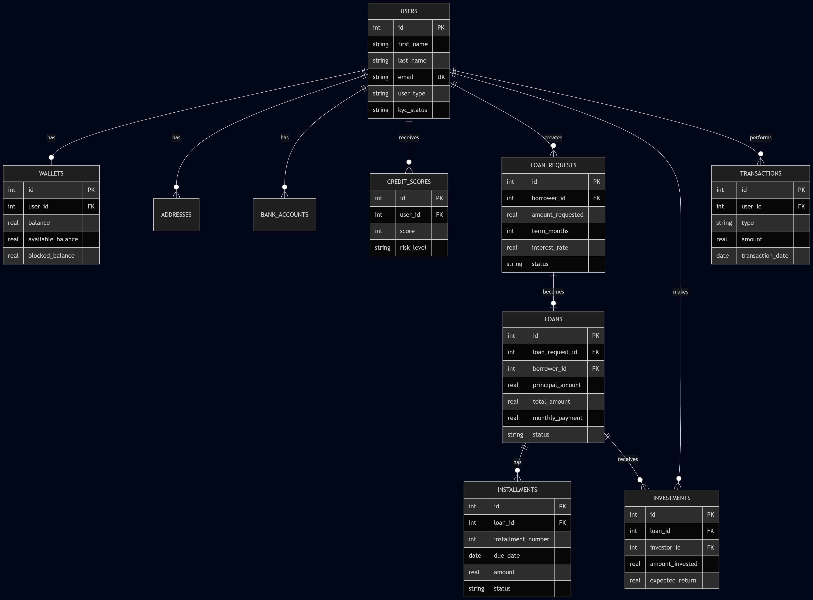

<div align="center">

# 💰 LendBridge

### *Peer-to-Peer Microfinance Lending Platform — Database Design*


[](https://www.sqlite.org/)
[](https://www.sqlite.org/)
[](https://cs50.harvard.edu/certificates/2f175611-cb43-421b-a477-a79d864ac45f)
[](https://opensource.org/licenses/MIT)

</div>

---

## 📖 Overview

**LendBridge** is a relational database design for a **Peer-to-Peer (P2P) microfinance lending platform** — connecting individual investors directly with borrowers, removing traditional banking intermediaries.

Inspired by real-world FinTech platforms (Aspiration, Bairong Yunda, Ezubao), this project models the full lifecycle of a digital lending operation: from KYC and credit scoring to loan origination, fractional investment, installment tracking, and full financial ledger.

> 🎓 Built as a deep-dive extension of the **Harvard CS50SQL** curriculum, applying advanced relational design to a real-world FinTech domain.

---

## 🎯 Key Features

- 👥 **Multi-role users**: borrowers, investors, or both
- 🔐 **KYC workflow** with verification status
- 💳 **Digital wallets** with available/blocked balance separation (prevents race conditions)
- 📊 **Credit scoring** with full history (300–850 FICO range)
- 💼 **Loan request workflow** (pending → approved → funded → active → completed/defaulted)
- 🤝 **Fractional investments** (multiple investors per loan)
- 📅 **Installment generation** with principal/interest separation
- 📒 **Immutable transaction ledger** (audit-grade financial history)
- 📈 **Performance views** for dashboards and risk analysis

---

## 🗂️ Entity-Relationship Diagram



---

## 🏗️ Database Schema

The database contains **10 tables**, **9 indexes**, and **4 analytical views**.

| Table | Purpose |
|---|---|
| `users` | All platform participants (borrowers, investors, both) |
| `addresses` | User addresses for KYC and billing |
| `bank_accounts` | External bank accounts for deposits/withdrawals |
| `wallets` | Internal digital wallet (1:1 with user) |
| `credit_scores` | Historical credit assessments |
| `loan_requests` | Borrower applications (approval workflow) |
| `loans` | Active loan contracts |
| `investments` | Investor stakes in loans (fractional) |
| `installments` | Monthly payment schedule |
| `transactions` | Complete financial ledger |

---

## 🚀 Getting Started

### Prerequisites

- [SQLite 3](https://www.sqlite.org/download.html) installed

### Installation

```bash
# Clone the repository
git clone https://github.com/The-Special-One1/lendbridge.git
cd lendbridge

# Create and populate the database
sqlite3 lendbridge.db < schema.sql

# Run example queries
sqlite3 lendbridge.db < queries.sql